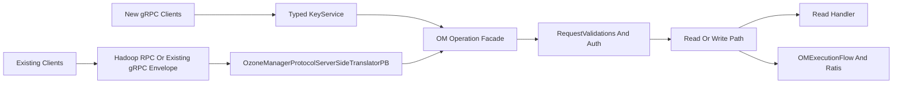

# Gradual OM gRPC Migration Plan

## What The PoC Shows

The prototype in `ozone/ozone-grpc-poc` is a good communication artifact. It contrasts the current single-envelope API with a typed gRPC API:

- `ozone/ozone-grpc-poc/src/main/proto/ozone_poc.proto` models old `submitRequest(OmRequest)` versus new `KeyService.ListKeys` and `KeyService.RenameKey`.
- `ozone/ozone-grpc-poc/src/main/java/poc/server/PlainKeyServiceImpl.java` shows server-streaming `ListKeys` and unary `RenameKey`.
- `ozone/ozone-grpc-poc/src/main/java/poc/interceptor/TokenAuthInterceptor.java` demonstrates metadata-based auth and caller propagation through gRPC `Context`.
- The README correctly highlights the main product goals: avoid client-side preflight chatter, make listing streamable, and replace the one-method envelope with typed operations.

The biggest implementation detail to keep in mind: Ozone already has a gRPC transport in `ozone/hadoop-ozone/ozone-manager/src/main/java/org/apache/hadoop/ozone/om/GrpcOzoneManagerServer.java`, but it still exposes the old `OzoneManagerService.submitRequest(OMRequest)` envelope and forwards into `ozone/hadoop-ozone/ozone-manager/src/main/java/org/apache/hadoop/ozone/protocolPB/OzoneManagerProtocolServerSideTranslatorPB.java`. The migration is therefore not “add gRPC” only; it is “add typed gRPC services while preserving the OM request lifecycle.”

## Target Shape

The new typed services should run beside the old envelope path first. Internally, they should reuse the same OM semantics, not fork business logic.

## Phase 1: Define A Real Production Schema

Start with a new proto beside `ozone/hadoop-ozone/interface-client/src/main/proto/OmClientProtocol.proto`, not by replacing it. A realistic first service could be `OzoneKeyService` with `ListKeys`, `ListKeysLight`, and `RenameKey`.

The PoC request messages are intentionally too small. Production messages need fields from current requests and client behavior:

- `ListKeys`: `volume`, `bucket`, `prefix`, `startKey`, `maxKeys` or stream batch hint, `shallow` or a separate `ListStatus` service, `readConsistencyHint`, client version, optional expected bucket layout, and whether the response is full `OmKeyInfo` or lightweight `BasicOmKeyInfo`.
- `RenameKey`: `volume`, `bucket`, `fromKey`, `toKey`, bucket layout or layout negotiation, client version, overwrite/conflict semantics if you choose to encode filesystem rename rather than object key rename.
- Shared request metadata: trace ID, client ID, layout version, caller context, and a reliable caller identity model.
- Response/error model: map `OMException.ResultCodes` to gRPC status plus rich error details so existing clients can preserve behavior.

Avoid making the first typed API too REST-like if that loses OM semantics. For example, `RenameKey` and filesystem `RenamePath` are not the same operation in non-FSO buckets.

## Phase 2: Add Server-Side Typed Services As Adapters

Register a new typed service in `ozone/hadoop-ozone/ozone-manager/src/main/java/org/apache/hadoop/ozone/om/GrpcOzoneManagerServer.java` alongside the existing envelope service. Initially, implement typed methods as thin adapters into the existing OM pipeline.

For `RenameKey`, the safest first adapter is:

- Convert typed `RenameKeyRequest` into the existing `OMRequest(Type.RenameKey)`.
- Reuse `OzoneManagerProtocolServerSideTranslatorPB.submitRequest` in `ozone/hadoop-ozone/ozone-manager/src/main/java/org/apache/hadoop/ozone/protocolPB/OzoneManagerProtocolServerSideTranslatorPB.java` so `RequestValidations`, S3/non-S3 identity stamping, `OMExecutionFlow`, Ratis, retry cache, audit, metrics, and layout-specific request classes remain unchanged.
- Return a typed `RenameKeyResponse` translated from `OMResponse`.

For `ListKeys`, choose one of two steps:

- Conservative first step: typed unary page API that delegates to existing `ListKeys` / `ListKeysLight`, proving parity without streaming.
- Next step: server-streaming API that loops through existing read logic internally and streams one item at a time. This moves pagination off the client but still uses current metadata manager behavior.

Do not let the typed service directly call managers until the shared operation facade is explicit. Otherwise the new path will bypass subtle validation, auth, audit, metrics, and compatibility behavior.

## Phase 3: Fix Current gRPC Couplings Before Broad Rollout

`ozone/hadoop-ozone/ozone-manager/src/main/java/org/apache/hadoop/ozone/om/OzoneManagerServiceGrpc.java` currently fabricates a Hadoop `Server.Call` for each gRPC request because OM Ratis still depends on Hadoop IPC thread context for client ID/call ID behavior. This is a major gap for a real replacement.

Before typed gRPC can replace Hadoop RPC broadly, introduce an OM request context abstraction that carries:

- authenticated user / groups;
- remote IP and hostname;
- trace ID and caller context;
- retry identity, client ID, and call ID;
- request deadline/cancellation state;
- transport type.

Then migrate Ratis request creation, lock timing, retry cache, and audit code away from direct `Server.getCurCall()` / `ProtobufRpcEngine.Server.getRemoteUser()` assumptions.

## Phase 4: Security And Authorization Parity

The PoC token interceptor is useful, but production cannot just use a hardcoded metadata token.

A production design needs one or more supported auth modes:

- mTLS for OM gRPC channels when security is enabled;
- Kerberos-to-token exchange for CLI/Hadoop clients;
- delegation token support equivalent to `OmTransport.getDelegationTokenService` in `ozone/hadoop-ozone/common/src/main/java/org/apache/hadoop/ozone/om/protocolPB/OmTransport.java`;
- S3 auth compatibility for gateway flows;
- caller identity propagation into `OMClientRequest.getUserInfo`-equivalent logic in `ozone/hadoop-ozone/ozone-manager/src/main/java/org/apache/hadoop/ozone/om/request/OMClientRequest.java`.

Authorization must continue to flow through existing Ozone ACL / Ranger checks. For writes, preserve `preExecute` user stamping before Ratis replication. For reads, preserve `OmMetadataReader` ACL checks and read consistency behavior.

## Phase 5: Client Migration With Feature Flags

Keep `ozone/hadoop-ozone/common/src/main/java/org/apache/hadoop/ozone/om/protocolPB/Hadoop3OmTransport.java`, `ozone/hadoop-ozone/common/src/main/java/org/apache/hadoop/ozone/om/protocolPB/GrpcOmTransport.java`, and `ozone/hadoop-ozone/common/src/main/java/org/apache/hadoop/ozone/om/protocolPB/OmTransportFactory.java` intact while adding a new typed gRPC client path.

Rollout order:

- Add typed gRPC client stubs behind a config flag.
- Route only `listKeys` / `listKeysLight` first, because they are reads and easier to compare safely.
- Add `renameKey` next for object key rename.
- Treat filesystem `rename(Path, Path)` separately, especially non-FSO directory rename in `ozone/hadoop-ozone/ozonefs-common/src/main/java/org/apache/hadoop/fs/ozone/BasicOzoneFileSystem.java`, because that is where client-side status checks, listing, per-key renames, and fake parent directory creation currently happen.

For non-FSO filesystem rename, consider a new `RenamePath` operation rather than only `RenameKey`. That is the API that can actually remove many redundant calls.

## Phase 6: Validate Parity And Measure Wins

Add tests and metrics before switching defaults:

- Golden parity tests comparing old envelope and typed gRPC responses for `listKeys`, `listKeysLight`, and `renameKey` across bucket layouts.
- RPC-count tests around `OzoneBucket.listKeys` iterator and filesystem `listStatus` / `rename` scenarios.
- Secure-cluster tests for Kerberos, delegation token, S3 auth, TLS, and unauthorized calls.
- HA tests for failover, follower reads, leader-only writes, retry cache, and Ratis replay.
- Streaming tests for cancellation, backpressure, client deadlines, max message size, and memory behavior.
- Compatibility tests for older clients and response validators such as list-key EC replication response handling.

## Important Gaps In The PoC

- It does not model Ratis, retry cache, leader checks, HA failover, follower reads, or read consistency.
- It does not model `RequestValidations`, layout versioning, client version compatibility, audit, lock metrics, or large-response limits.
- It does not model Ozone ACL / Ranger authorization or Kerberos/delegation-token authentication.
- `ListKeysRequest` lacks prefix, start key, max result count, shallow/list-status semantics, `ListKeysLight`, and response truncation compatibility.
- `RenameKey` is too simple for production: FSO and non-FSO have different server paths; filesystem path rename is different from key rename.
- Server streaming needs cancellation/deadline handling and a bounded execution model; the plain `ExecutorService` example can continue work after cancellation.
- Error handling needs a stable mapping from `OMException.ResultCodes` to gRPC status and structured error details.
- Current Ozone gRPC code still depends on synthetic Hadoop `Server.Call`; this must be removed before claiming Hadoop RPC has been replaced.

todos:

- id: schema-inventory
content: Inventory existing OM request fields and define production typed protobufs for list and rename.
- id: typed-server-adapter
content: Add typed gRPC services beside existing envelope service and delegate initially to the current OM translator/pipeline.
- id: request-context
content: Introduce a transport-neutral OM request context to replace Hadoop IPC thread-context assumptions.
- id: auth-parity
content: Design gRPC auth for Kerberos, delegation tokens, S3 auth, mTLS, and ACL/Ranger identity propagation.
- id: client-rollout
content: Add feature-flagged typed gRPC client paths, starting with list operations before mutations.
- id: parity-tests
content: Add parity, RPC-count, secure-cluster, HA/failover, and streaming cancellation tests.

